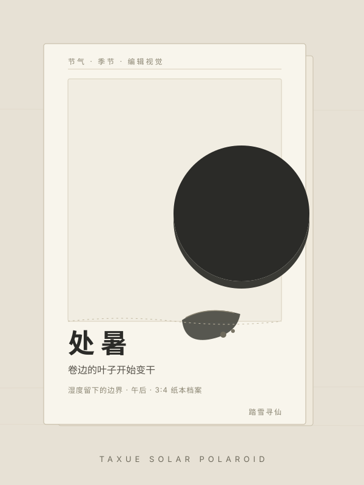
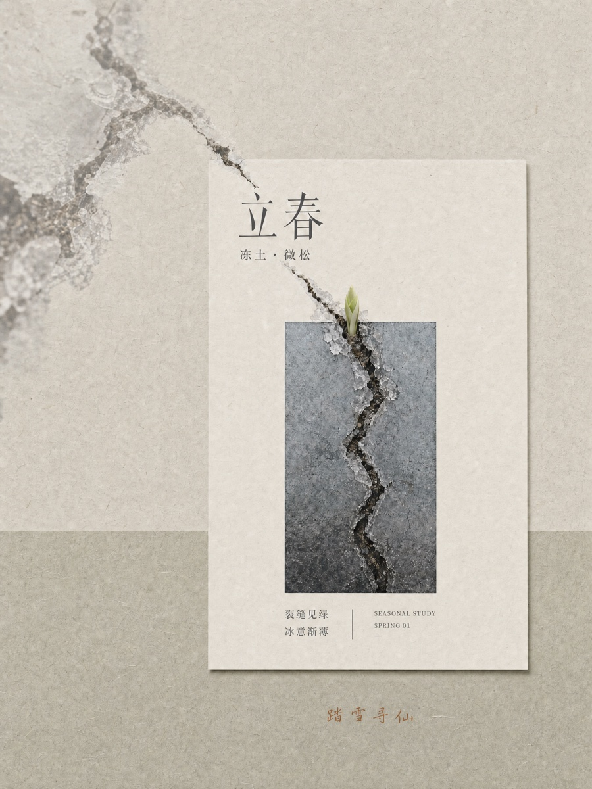
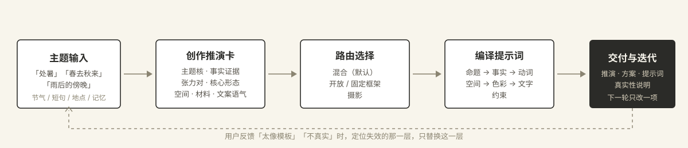

<p align="center">



</p>

<p align="center">
  <a href="#成图">成图</a> ·
  <a href="#不把节气翻译成一片叶子">理念</a> ·
  <a href="#四种模式">模式</a> ·
  <a href="#二十四节气物候线索">物候</a> ·
  <a href="#怎么工作">怎么工作</a> ·
  <a href="#文件结构">文件结构</a> ·
  <a href="#开始使用">开始使用</a>
</p>

# 踏雪节气拍立得

输入「冬至」「春去秋来」「一场雨之后」，输出一张有**事实证据、自然文案、原创空间逻辑**的编辑视觉提示词。不把节气翻译成一片固定叶子。

## 成图

样张均为混合模式出图，未加署名标记。点图看原图。




<p align="center">
<a href="./gallery/lichun-hybrid-no-mark.jpg">立春</a> ·
<a href="./gallery/daxue-no-mark-test.jpg">大雪</a> ·
<a href="./gallery/README.md">全部原图</a>
</p>

## 不把节气翻译成一片叶子

「立春」不等于嫩芽，「处暑」不等于荷叶。每个节气在不同地点、不同材料和不同记忆里，应该长出不同的画面。

本技能先建立**创作推演卡**，再选择媒介、形态、空间与文案：

| 推演字段 | 目的 |
|---|---|
| 主题核 | 一句话说清「什么正在以何种方式改变」 |
| 事实证据 | 用户给的地点、材料、记忆最优先；没有时标注为创作性解释 |
| 张力对 | 湿/干、近/远、聚/散、停/行，决定颜色与空间 |
| 核心形态 | 从方向、过程、连接、断裂中提取，不默认是植物 |
| 空间规则 | 网格、折页、空白、层叠、档案页，不默认居中卡片 |
| 媒介材料 | 纸、摄影、丝网、布料、玻璃，不拿泛黄冒充质感 |
| 文案语气 | 观察、记录、私语、索引，每句都能回到画面证据 |

**真实性纪律：** 用户没有提供地点和日期时，不写「今日」「此地」「今年最早」；不用古诗、典故和节气口号；不伪造真实天气与物候。

## 四种模式

| 模式 | 什么时候用 | 做什么 |
|---|---|---|
| **混合模式**（默认） | 只输入「处暑」「春去秋来」这类节气或季节短句 | 开放推演决定内容，纸本档案结构提供系列秩序。内容由主题决定，框架不覆盖主题判断 |
| **开放模式** | 明确说「开放式」「不要模板」「概念海报」 | 只做开放推演，完全脱离纸本框架 |
| **固定框架模式** | 明确说「保持那套框架」「档案纸页」「系列感」 | 锁定纸张与阅读层级，仍由主题推演填充变量 |
| **摄影模式** | 明确说「人物」「街拍」「拍立得」「镜头感」 | 开放推演后走镜头、人物与空间，不排纸本档案 |

要几张就几张。多张组图先生成**解释矩阵**：每张至少改变主题角度、事实证据、核心形态、空间规则、媒介、文案语气中的两项，禁止同一张卡片换色、镜像或机械重排。

## 二十四节气物候线索

`references/seasonal-evidence-library.md` 提供二十四节气的**常见变化方向**，只作为创作性转译的候选，不作为地点或天气事实。每个节气取一项状态转折和一项可见证据，其余由推演决定：

| 节气 | 常见状态转折（供创作推演） | 可见证据候选（非强制） |
|---|---|---|
| 立春 | 冻结向松动；封闭向初开 | 薄冰边缘、松土、窗缝透光、嫩芽、衣物减层 |
| 雨水 | 干燥向潮湿；静止向滴落 | 伞沿、玻璃水痕、屋檐、湿地面、发亮树皮 |
| 惊蛰 | 潜伏向微动；低沉向唤醒 | 裂土、草叶颤动、风、远雷后的湿度 |
| 春分 | 不均向平衡；冷暖交界 | 对半光影、半开窗、并置的干湿物件 |
| 清明 | 潮湿向清亮；近景向远雾 | 石阶湿痕、柳枝、薄雾、低饱和的天空 |
| 谷雨 | 细雨向滋长；稀疏向饱满 | 叶面积水、种子、窗台潮气、土壤色变 |
| 立夏 | 轻薄向浓密；温和向有热度 | 树荫加深、杯壁结露、日影变硬、衣料更轻 |
| 小满 | 接近完成但尚未溢出 | 未熟穗粒、鼓起的果皮、风中的布料 |
| 芒种 | 生长向劳作；分散向投入 | 细长禾草、种子、泥点、门槛阴影 |
| 夏至 | 光线最长；阴影最短 | 直射光、明亮窗帘、短阴影、水面反光 |
| 小暑 | 热度初积；空气变慢 | 微汗、风扇、果皮水分、午后室内 |
| 大暑 | 热度压低；雨前停滞 | 厚云、晒热墙面、卷叶、冷饮水珠 |
| 立秋 | 盛绿向初黄；热感向初凉 | 第一片变色叶、薄外套、傍晚侧光 |
| 处暑 | 余热向退场；潮湿向通透 | 卷边荷叶、残留水珠、降低的光强、窗边风 |
| 白露 | 水汽显形；晨光变冷 | 露珠、玻璃雾气、薄针织、叶缘亮点 |
| 秋分 | 昼夜接近；成熟开始收束 | 栗子、半开窗、收拢的枝叶、平衡光面 |
| 寒露 | 清冽向寒；湿气更重 | 草尖冷亮、水汽、空椅、薄霜前的叶缘 |
| 霜降 | 丰满向枯落；颜色变深 | 薄霜、干叶、空枝、呼吸可见的前兆、低日角 |
| 立冬 | 外部收缩；内部蓄热 | 热饮蒸汽、厚衣料、枯枝、室内暖点、晴冷光 |
| 小雪 | 初白但未覆盖；轻落 | 伞面细雪、深色叶面白点、湿冷地面、灰蓝光 |
| 大雪 | 覆盖与压低；内外反差 | 压雪枝、脚印、门框、室内暖光、积雪的软边 |
| 冬至 | 夜长向回光；低温中蓄热 | 短日光、碗中热汽、深色陶、窗外蓝黑、半融冰 |
| 小寒 | 冷感清晰；边缘结晶 | 冰花、冻水洼、硬朗晨光、玻璃雾线、细枝 |
| 大寒 | 寒极向等待；空场加深 | 空街、干枝、暗果、傍晚路灯、厚实织物 |

完整表格（含全部二十四节气与使用法）在 `references/seasonal-evidence-library.md`。用户提供的地点、实际时间、材料和经验始终优先于本表。

## 怎么工作

<p align="center">
  
</p>

1. **建立创作推演卡**　主题核、事实证据、张力对、核心形态、空间规则、媒介材料、文案语气七项依次确定。
2. **选择视觉路线**　默认混合模式；用户点名时切开放、固定框架或摄影。
3. **编译提示词**　按固定顺序：用途与数量 → 创作命题 → 事实基础 → 视觉动词 → 空间与媒介 → 色彩与光 → 文字 → 约束。
4. **交付与迭代**　交付推演、方案、可粘贴提示词、画内文字、真实性说明；下一轮只改一个变量。

## 文件结构

```
taxue-solar-polaroid/
├── README.md                  # 本介绍页
├── SKILL.md                   # 技能本体：原则、工作流、交付标准
├── gallery/                   # 成图样张（立春、大雪，点图看原图）
├── references/
│   ├── dynamic-creative-router.md     # 开放式创作路由：七项推演卡与形态选择
│   ├── dual-layer-routing.md          # 双层路由：开放层 × 纸本档案结构母版
│   ├── art-directed-archive-master.md # 纸本档案路线：可变材料与编辑策略
│   └── seasonal-evidence-library.md   # 二十四节气物候线索库（非模板）
├── templates/
│   └── taxue-solar-polaroid.txt       # 可整段复制的对话模型元提示词
├── assets/readme/             # 介绍页配图
└── scripts/
    └── consistency-check.py   # 结构一致性检查（只读）
```

## 开始使用

```bash
npx skills add taxueseek/taxue-solar-polaroid
```

装好后直接说：

- 「冬至」　「处暑」　「春去秋来」
- 「用纸本档案的感觉做一张谷雨海报」
- 「立夏，四张，一组杂志内页」
- 「雨后的傍晚，落地窗，拍立得感觉」

## 隐私

本技能不收集任何数据。它只做一件事：把主题编译成提示词。你的地点、时间、材料与记忆只在对话中出现，不出本地、不入库。

## License

MIT
