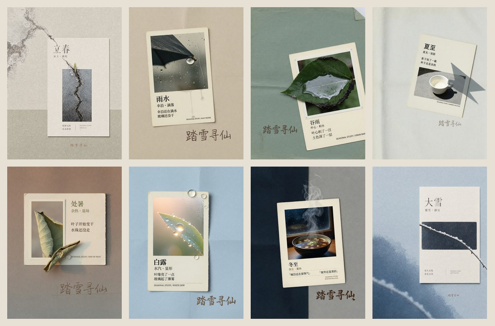

<p align="center">
  简体中文 · <a href="README.en.md">English</a>
</p>

<p align="center">
  
</p>

<p align="center">
  <a href="#节气">节气</a> ·
  <a href="#节日">节日</a> ·
  <a href="#不把节气翻译成一片叶子">理念</a> ·
  <a href="#四种模式">模式</a> ·
  <a href="#怎么工作">怎么工作</a> ·
  <a href="#开始使用">开始使用</a>
</p>

# 踏雪节气拍立得

## 生图技能家族

同属踏雪生图系列，先认门，再用对技能：

| 技能 | 一句话 | 仓库 |
|---|---|---|
| **踏雪创意风格**（影像风格引擎） | 14 个家族、77 个变体：按风格出图、改提示词、从零写、记住偏好 | [taxue-creative-style](https://github.com/taxueseek/taxue-creative-style) |
| **半调海报**（印刷质感引擎） | 11 种风格 + 1 个变体：一句话、一个主题或一张照片，做成印刷感封面 | [taxue-halftone](https://github.com/taxueseek/taxue-halftone) |
| **节气拍立得**（节气创作引擎） | 节气、节日、物候短句，推出有记忆点的海报、纸本档案与拍立得 | **你在这里** · [taxue-solar-polaroid](https://github.com/taxueseek/taxue-solar-polaroid) |

## 成图

下面是两组成图。远看像同一套纸页，近看每张的窗口和字都不一样。点题名看原图。

### 节气

八张，从立春走到大雪。

<p align="center">



</p>

<p align="center">
<a href="./gallery/lichun-hybrid-no-mark.jpg">立春</a> ·
<a href="./gallery/yushui-hybrid.jpg">雨水</a> ·
<a href="./gallery/guyu-hybrid.jpg">谷雨</a> ·
<a href="./gallery/xiazhi-hybrid.jpg">夏至</a> ·
<a href="./gallery/chushu-hybrid.jpg">处暑</a> ·
<a href="./gallery/bailu-hybrid.jpg">白露</a> ·
<a href="./gallery/dongzhi-hybrid.jpg">冬至</a> ·
<a href="./gallery/daxue-hybrid-no-mark.jpg">大雪</a>
</p>

### 节日

六张：春节、元宵、端午、七夕、中秋、重阳。不画喜鹊桥、玉兔或龙舟，可见证据分别是红纸余灰、热灯纸、湿箬叶、两星一线、空杯月光、未走完的石阶。

<p align="center">


</p>

<p align="center">
<a href="./gallery/chunjie-hybrid.jpg">春节</a> ·
<a href="./gallery/yuanxiao-hybrid.jpg">元宵</a> ·
<a href="./gallery/duanwu-hybrid.jpg">端午</a> ·
<a href="./gallery/qixi-hybrid.jpg">七夕</a> ·
<a href="./gallery/zhongqiu-hybrid.jpg">中秋</a> ·
<a href="./gallery/chongyang-hybrid.jpg">重阳</a> ·
<a href="./gallery/README.md">全部原图</a>
</p>

## 不把节气翻译成一片叶子

「立春」不等于嫩芽，「处暑」不等于荷叶，「七夕」不等于牛郎织女。每个主题在不同地点、不同材料和不同记忆里，应该长出不同的画面。

本技能先建立**创作推演卡**，再选择媒介、形态、空间与文案：

- **主题核**　一句话说清「什么正在以何种方式改变」
- **事实证据**　用户给的地点、材料、记忆最优先；没有时标注为创作性解释
- **张力对**　湿/干、近/远、聚/散、停/行，决定颜色与空间
- **核心形态**　从方向、过程、连接、断裂中提取，不默认是植物
- **空间规则**　网格、折页、空白、层叠、档案页，不默认居中卡片
- **媒介材料**　纸、摄影、丝网、布料、玻璃，不拿泛黄冒充质感
- **文案语气**　观察、记录、私语、索引，每句都能回到画面证据

**真实性纪律：** 用户没有提供地点和日期时，不写「今日」「此地」「今年最早」；不用古诗、典故和节气口号；不伪造真实天气与物候。

**和提示词库的分界：** 提示词库是从一万条里挑一条像的；这里是七个推演变量，从你的主题里长出一条。同一次输入，换一个地点、换一段记忆，画面就会变。

## 四种模式

- **混合**（默认）　只输入节气、节日或短句时：开放推演定内容，纸本档案给系列秩序。
- **开放**　不要模板、要概念海报时：只做开放推演，脱离纸本框架。
- **固定框架**　要档案纸页、要系列感时：锁定纸张与阅读层级，主题仍可变。
- **摄影（物证拍立得）**　要人物、街拍、镜头感时：走镜头与空间，不排纸本档案；拍立得窗口里钉的是主题物证，不是流行合照的复刻。

要几张就几张。多张组图先生成**解释矩阵**：每张至少改主题角度、事实证据、核心形态、空间规则、媒介、文案语气中的两项，禁止同一张卡片换色或镜像。

## 物候线索

`references/seasonal-evidence-library.md` 给出二十四节气的常见变化方向，只作创作候选。每个节气只取一项状态转折和一项可见证据。用户给的地点、时间和材料始终优先。

## 怎么工作

<p align="center">
  
</p>

1. **建立创作推演卡**　主题核、事实证据、张力对、核心形态、空间规则、媒介材料、文案语气七项依次确定。
2. **选择视觉路线**　默认混合模式；用户点名时切开放、固定框架或摄影。
3. **编译提示词**　按固定顺序：用途与数量 → 创作命题 → 事实基础 → 视觉动词 → 空间与媒介 → 色彩与光 → 文字 → 约束。
4. **交付与迭代**　交付推演、方案、可粘贴提示词、画内文字、真实性说明；下一轮只改一个变量。

## 开始使用

```bash
npx skills add taxueseek/taxue-solar-polaroid
```

装好后直接说：

- 「立春」　「元宵」　「一场雨之后」　「冬至」　「春去秋来」
- 「用纸本档案的感觉做一张谷雨海报」
- 「立夏，四张，一组杂志内页」
- 「雨后的傍晚，落地窗，拍立得感觉」

## 文件结构

```text
taxue-solar-polaroid/
├── README.md
├── SKILL.md
├── gallery/              # 节气八张、节日六张
├── references/           # 推演、双层路由、物候库、物证拍立得
├── templates/
├── assets/readme/        # 5:2 头图、节气墙、节日墙、流程
└── scripts/              # 只读一致性检查 + 提示词 lint
```

## 隐私

本技能不收集任何数据。它只做一件事：把主题编译成提示词。你的地点、时间、材料与记忆只在对话中出现，不出本地、不入库。

## License

MIT
